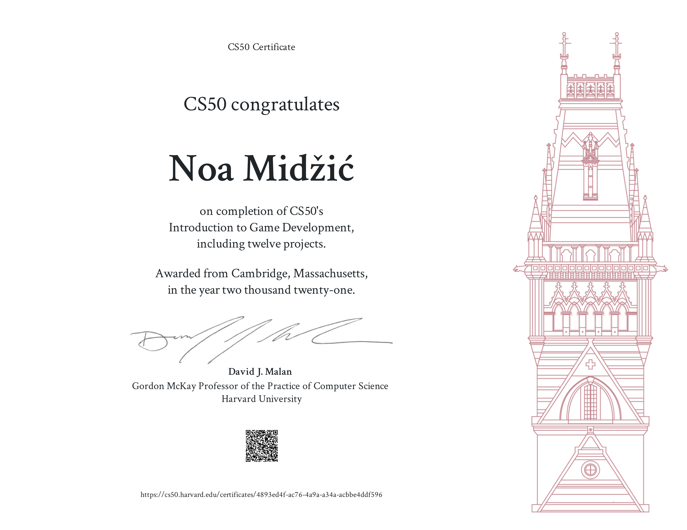

My first Unity game, created for the final project for Harvard's course "CS50's Introduction to Game Development".

A 3D game where the player explores an island to find all 3 pieces of a sword and use it to defeat the boss on the top of a mountain.

Player character created in MakeHuman software.
Mooks, boss, skybox and nature assets are free assets from Unity's Asset Store.

# Installation

`unity` directory contains game files to be opened in Unity (navigate to Resources/Scenes and run the scene).
`exe` directory contains .exe game file.

To start the game, navigate to `exe` and run `Island.exe`.

# Controls

- Moving - WASD keys
- F key - switch between first and third person
- Shift - Run
- Spacebar - Jump/Roll
- Enter - Sheathe/Unsheathe sword
- Left mouse click - Sword attack 1
- Right mouse click - Sword attack 2

Forgot to add key to quit the game, so it can only be ended via Task Manager.

# Demo

[Demo video](https://www.dropbox.com/s/wbkl46dd70ym5am/island_prototype_demo.mp4?dl=0)

# Certificate

